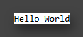

# Texscript Version 1
To setup:

```shell
# Clone template repository
git clone https://github.com/M9J/texscript-v2.git

# Change to cloned repository
cd texscript-v2

# Install dependencies
npm install
```

To run development server for ./src directory:

```shell
# Run development server on ./src directory
npm run serve
```

To run development server for ./lib/v1 (Texscript v1 source) directory:

```shell
npm run v1-dev
```

To generate Texscript v1 production build:

```shell
# Build the project to dist/ folder
npm run v1-build
```

To build and preview Texscript v1:

```shell
# Preview the contents of the dist/ folder
npm run v1-preview
```

This will make the production build version of Texscript v1 available at `localhost/texscript/v1`


# Example
helloWorld.html:
```tsx
// Loading the Texscript Compiler
<script src="<LIBURL>/v1/texscript.js" defer type="module"></script>

// Writing the Texscript
<script type="text/texscript">
  Page: "Hello World"
</script>
```

Will render:

